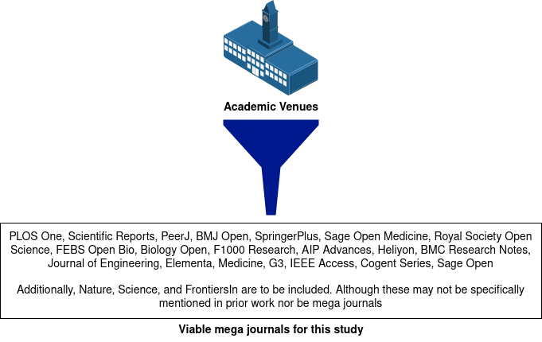
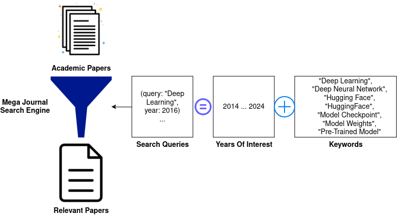
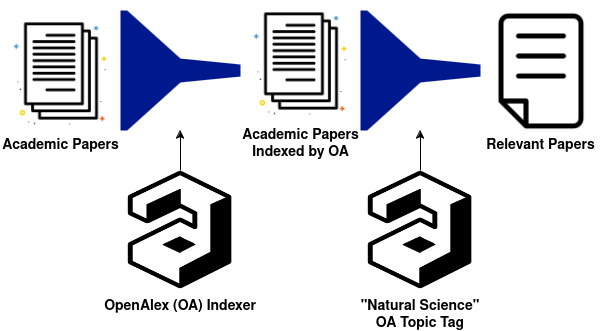

# AI Usage in Science

> A research project to understand how researchers studying who leverage
> scientific computing reuse DNNs within their work

## Table of Contents

- [AI Usage in Science](#ai-usage-in-science)
  - [Table of Contents](#table-of-contents)
  - [About](#about)
  - [Dependencies](#dependencies)
  - [How to Install](#how-to-install)
  - [How to Contribute](#how-to-contribute)
  - [Project Tutorial](#project-tutorial)
    - [Reimplementing From Existing Dataset](#reimplementing-from-existing-dataset)
    - [Reimplementing From Scratch](#reimplementing-from-scratch)
      - [Search For Papers In Mega Journals](#search-for-papers-in-mega-journals)
      - [Filtering Academic Papers](#filtering-academic-papers)

## About

This repository contains the source code for a research project to identify:

1. if DNNs are resused by researchers,
1. the scope at which DNNs are reused, and
1. how DNNs are reused

within academic research in popular
[mega journals](https://en.wikipedia.org/wiki/Mega_journal).

## Dependencies

We wrote this project targetting
[`python3.10`](https://www.python.org/downloads/release/python-3100/). This
project uses the [`poetry`](https://python-poetry.org/) build system to handle
libraries and modules.

If you are planning to contribute to this project, please use our
[`pre-commit`](https://pre-commit.com/)
[`git hooks`](https://git-scm.com/book/en/v2/Customizing-Git-Git-Hooks) to help
format your work prior to committing.

## How to Install

This project was tested on Linux x86-64 machines. Your mileage may vary on
different architectures.

1. `git clone https://github.com/NicholasSynovic/research_ai-usage-in-science`
1. `make create-dev`
1. `make build`

## How to Contribute

We prefer to develop in Linux x86-64 environments Ubuntu environment for our
research projects. We reccommend developing within a similar environment for
maximum compatibility

1. `git clone https://github.com/NicholasSynovic/research_ai-usage-in-science`
1. `make create-dev`
1. `make build`
1. `pre-commit install`

## Project Tutorial

If you are new to the project or you are trying to recreate our work from
scratch, the following tutorial outlines in detail what we did to collect,
parse, and present our findings from this data.

### Reimplementing From Existing Dataset

> TODO: Add this section TODO: Upload data to Zenodo

### Reimplementing From Scratch

We will assume that you have properly installed this project on your machine to
reduce repetition. If not, see [*How to Install*](#how-to-install)

#### Search For Papers In Mega Journals

Our research focuses on academic papers that were published within mega
journals. We leverage mega journals as they, by definition, support open access
and typically have lenient licensing with respect to downloading and parsing the
content of the works.

#### Filtering Academic Papers

